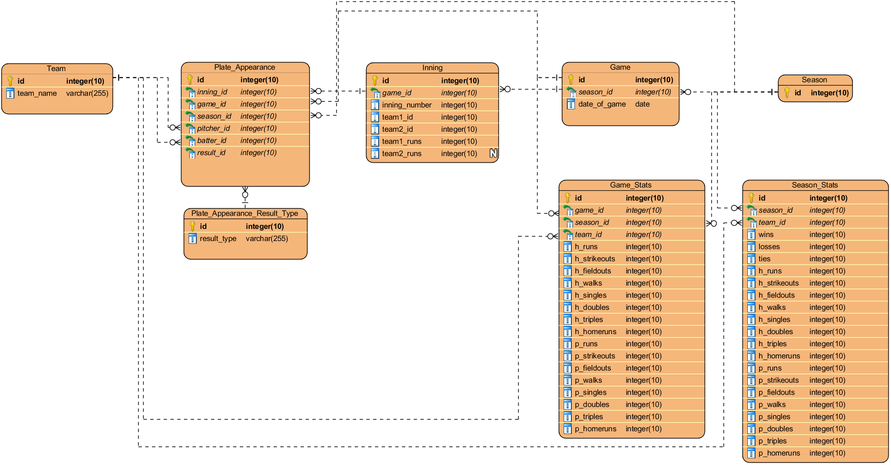

# Backyard Wiffleball Scorekeeper
This is a WIP program which serves to act as an interface to interact with Wiffleball game stats. I have created this over the span of a few days during the first stay-at-home order period of COVID-19 pandemic. My little brother, Colin, and I have played tons of backyard wiffleball/baseball; we have created our own rules and love to keep stats. This system (the client and database) allows us to store and interact with our game stats. 

I created this system on a whim, and therefore not a ton of care was put into it. The source code is heavily coupled and lightly commented. There are some parts which are made to be interacted with for multiple 1-person teams, and there are some parts which only work for Colin and myself. If I feel the need, I will update it.

At the moment the system currently allows for adding new games as well as viewing a game log, raw and graphical stats, and records. The SQL script used to create the tables and relations is included, as well as an Entity-relationship model diagram.

-------------------------------------------------------------------------------------------------------------------------------

The RDBMS in use is PostreSQL version 12.2. The Java SDK in use is OpenJDK 11.0.6.10 along with the JavaFX 11.0.2 SDK. Also used are the most recent Spring Framework libraries applicable for JBDC.

-------------------------------------------------------------------------------------------------------------------------------

